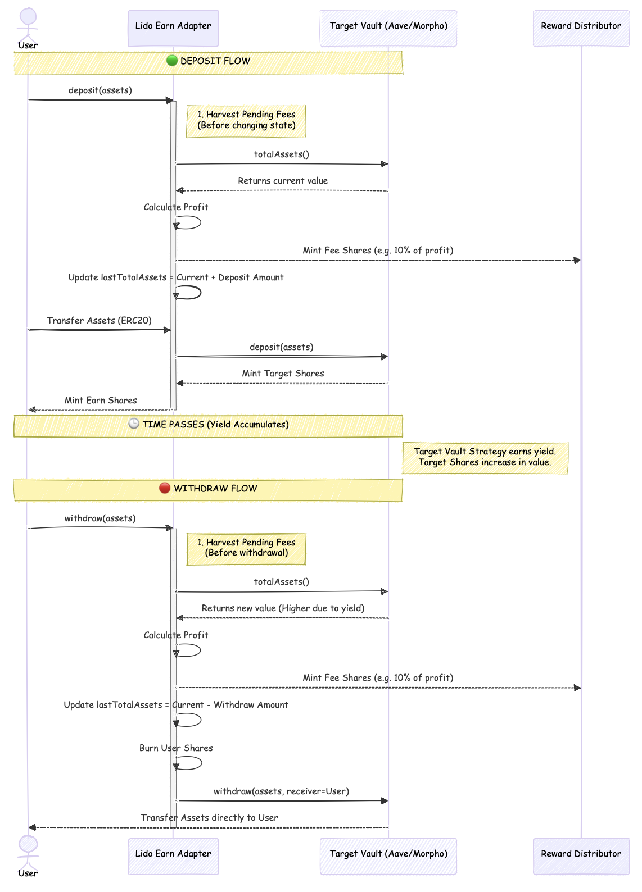

# Lido Defi-interface – Architecture & Specification

## Context and Problem Statement

The project builds a DeFi accessibility layer for institutional capital. Stakeholders require standard vault primitives that plug into existing custody, reporting, and compliance systems without custom work. Existing DeFi integrations lack unified interfaces, consistent fee distribution, and robust emergency tooling. The architecture therefore must:

- Present a single interface while hiding protocol differences.
- Make adapter integrations fast and predictable.
- Guarantee fee harvesting and distribution in a way that partners can audit.
- Provide crisis tooling that satisfies risk/compliance demands.

## Core Constraints & Assumptions

To address the problem statement effectively while maintaining security constraints, the system operates under the following strict boundaries:

1.  **Unified Standard Interface:** The system must expose a strict **ERC4626** interface. All custom logic (emergency modes, fee harvesting) must be encapsulated within standard methods to ensure seamless integration with existing tools.
2.  **Transparent Reward Splits:** Fee distribution schedules must remain transparent and auditable. Already-minted fee shares cannot be redirected, while any configuration changes for future accruals require explicit administrative action.
3.  **Deterministic Crisis Handling:** The system must prioritize **solvency transparency** over continuity. In the event of a loss, the system must freeze and distribute remaining assets pro-rata rather than attempting to resume normal trading.
4.  **Asset Compatibility:** The architecture assumes strict **1:1 value preservation** during transfers. Because the contracts do not programmatically detect unsupported tokens, this constraint is enforced operationally by avoiding deployments against:
      * **Fee-on-Transfer Tokens:** Transfer taxes would break internal accounting.
      * **Rebasing Tokens:** Elastic supply tokens would desynchronize the High Water Mark logic.
      * **Target Vaults with Fees/Slippage:** Adapters cannot support strategies that charge deposit/withdrawal fees or incur slippage, as this would be misattributed as profit or loss.

## Proposed Solution

Lido Defi-interface acts as a standardized wrapper for underlying yield strategies. It introduces a modular architecture separating core accounting, emergency logic, and protocol-specific adaptation.

### Key Components

1.  **`Vault` (Base Layer):** Handles standard ERC4626 accounting, access control, inflation protection via virtual offsets, and performance fee harvesting.
2.  **`EmergencyVault` (Safety Layer):** Extends the base vault with "Emergency Mode" (pulling funds to safety) and "Recovery Mode" (pro-rata distribution of recovered assets).
3.  **`ERC4626Adapter` (Integration Layer):** A concrete implementation that forwards capital into target strategies (e.g., Aave, MetaMorpho) while respecting the constraints of the parent layers.
4.  **`RewardDistributor`:** A dedicated contract (typically set as the treasury) that redeems accumulated shares and distributes assets to recipients based on immutable allocation percentages.

## Architecture & Design Rationale

The architecture of Lido Defi-interface prioritizes security and predictability for institutional capital. Each structural decision represents a deliberate trade-off, where accepted risks are mitigated through specific on-chain mechanisms and operational controls.

### Standardization and Integration Security

The fundamental constraint was interoperability: custodians and reporting systems require standardized interfaces. Therefore, the system enforces strict adherence to the **ERC4626 standard**.

Furthermore, to ensure strictly accurate user expectations, the Vault overrides all standard **preview functions** (e.g., `previewDeposit`). These functions simulate the pending fee harvest, ensuring that the values displayed in user interfaces match the exact execution results—accounting for fee dilution—down to the last wei.

However, relying on external protocols for share valuation introduces the critical risk of Read-Only Reentrancy. Since the generic ERC4626Adapter implementation relies directly on the target protocol to report totalAssets via convertToAssets, it inherently trusts the underlying accounting. The adapter itself possesses no internal mechanism to detect if the target pool's state is being manipulated (e.g., via inflated virtual prices during a flash loan callback). Consequently, the mitigation strategy is primarily Operational and Selective: this base adapter is intended only for targets that are themselves atomic and manipulation-resistant (e.g., vanilla lending markets). Integrations with more complex strategies must supply their own adapter subclass that adds the necessary protocol-specific sanity checks.

Additionally, standard ERC4626 vaults are vulnerable to **Inflation Attacks** (or "donation attacks") on the first deposit. To neutralize this without breaking the standard, the `Vault` embeds a **decimals offset** for virtual assets. These mechanism effectively buffer the exchange rate, making price manipulation mathematically infeasible.

### Economic Integrity and Fee Logic

The system utilizes a **High Water Mark** model with synchronous fee harvesting to ensure self-contained economics without reliance on external keepers.

This approach introduces specific economic constraints regarding the underlying protocol. Since `Vault.deposit` calculates shares based on the input amount and simply adds this value to `lastTotalAssets`, the system assumes a strict **1:1 value preservation** during deposits.

  * **Risk:** If a target protocol charges entry fees or incurs slippage, `lastTotalAssets` would increase by more than the actual assets received, creating a "phantom" profit baseline that dilutes existing holders and blocks future fee capture.
  * **Mitigation:** The `ERC4626Adapter` architecture explicitly prohibits use with fee-on-transfer tokens or vaults with deposit fees.

Conversely, this logic effectively captures **Instant Rewards**. Because `lastTotalAssets` increases only by the explicitly deposited amount, any immediate surplus value generated in the underlying protocol (e.g., share appreciation or airdrops) is correctly recognized as profit. It is captured by the `_harvestFees` mechanism during the very next interaction, ensuring these rewards are subject to performance fees rather than being distributed as free yield.

### Deterministic Crisis Management

To handle critical failures such as hacks or **Emergency Withdrawal Insolvency**, the system distinguishes between temporary operational pauses and permanent solvency crises.

While standard `pause()` functionality is available for temporary maintenance (blocking deposits but allowing withdrawals), the system strictly rejects the idea of "resuming" normal operations after a realized loss. Resuming trading with diminished backing would allow the fastest users to withdraw their full principal at the expense of others, effectively subsidizing their exit with the remaining users' funds (a "bank run").

To prevent this, the architecture enforces a **one-way state transition** for solvency events. Upon a confirmed loss, the vault enters *Emergency Mode* to evacuate remaining funds, and then permanently transitions to *Recovery Mode* (becoming a "pumpkin"). Once in this state, deposits are disabled forever. Users can only exit via `redeem`, which switches to a mathematical snapshot: it distributes the recovered assets strictly **pro-rata** (`recoveryAssets / recoverySupply`). This ensures that any **Implicit Loss** is shared equally and transparently among all remaining shareholders.

This mechanism specifically addresses **Deferred Bad Debt Realization** (e.g., MetaMorpho v1.1 strategies). In scenarios where the target vault's `totalAssets` appears healthy but `maxWithdraw` collapses due to unrealized bad debt, standard accounting would overvalue shares. The `ERC4626Adapter` first mitigates this by clamping withdrawals to the target's available liquidity via `maxWithdraw`. If the debt is permanent, the Emergency/Recovery flow triggers the "implicit loss" calculation, ensuring the "phantom" value is written off and users only claim what is actually liquid.

### Operational Security and Access Control

The system relies on role-based access control, introducing the risk of **Admin Key Compromise**. A compromised admin could pause the vault or change fee parameters.

To mitigate this, the architecture strictly limits admin powers. The admin **cannot withdraw user principal** arbitrarily; they can only trigger `emergencyWithdraw` which moves funds to the `Vault` itself, not to an external wallet. The only way for funds to leave is via `distribute` (for fees) or `redeem` (for users). Fee distribution is further protected by the `RewardDistributor`: while administrators may rotate the treasury or swap recipient accounts for future accruals (e.g., to handle key rotations or compliance changes), fee shares that are already minted remain confined to the distributor until they exit via its manual `redeem`/`distribute` flow.

### Immutable Reward Distribution

To satisfy institutional requirements for predictable fee payouts, the architecture decouples fee *collection* from fee *allocation*. While the `Vault` calculates and mints fee shares, it does not determine the ultimate beneficiaries. In typical deployments the treasury points to a dedicated **`RewardDistributor`** contract, but this wiring is not enforced on-chain and must be maintained operationally (deployers could theoretically set `TREASURY` to any address).

This separation mitigates the risk of **Arbitrary Fee Redirection** on already captured rewards: once shares are minted to the treasury/distributor, an attacker cannot siphon those assets without interacting with the distributor’s manual `redeem`/`distribute` flow (which honors its current recipient list). Administrators retain the ability to rotate the treasury address or update recipients for future accruals—needed for operational key rotation—but historical fee shares already in the distributor remain bound to the configured split.

## Deposit/Withdrawal Flow

The following diagram illustrates the complete flow of deposits and withdrawals through the vault system:



## Technical Specification

### Contract `Vault` (Abstract)

Base contract implementing **ERC4626**, **ERC20Permit**, **AccessControl**, **Pausable**, and Fee logic. It serves as the foundation for specific adapters.

**Roles:**

  * `DEFAULT_ADMIN_ROLE`: Can grant and revoke all roles
  * `PAUSER_ROLE`: Can pause and unpause the vault (blocks deposits/mints)
  * `MANAGER_ROLE`: Can update fee parameters, update treasury address, and recover accidentally sent ERC20 tokens
  * `EMERGENCY_ROLE`: Can trigger emergency withdrawal and manage protocol approvals

#### `constructor`

Initializes the vault configuration, roles, and immutable parameters.

```solidity
constructor(
    IERC20 asset_,
    address treasury_,
    uint16 rewardFee_,
    uint8 offset_,
    string memory name_,
    string memory symbol_,
    address admin_
)
```

**Constraints:**

  * `asset_`, `treasury_`, and `admin_` must not be the zero address.
  * `rewardFee_` must not exceed `MAX_REWARD_FEE_BASIS_POINTS` (2,000 basis points / 20%).
  * `offset_` must not exceed `MAX_OFFSET` (23).

**Notes:**

  * Grants `DEFAULT_ADMIN_ROLE`, `PAUSER_ROLE`, `MANAGER_ROLE`, and `EMERGENCY_ROLE` to the `admin_` address.
  * Sets the immutable `OFFSET` variable.
  * Sets the storage `TREASURY` variable.
  * Initializes `ERC20` with the token name and symbol.
  * Initializes `ERC20Permit` with the token name, enabling gasless approvals.

#### Share Conversion Formulas with OFFSET

The vault uses a decimals offset mechanism to protect against inflation attacks. The `OFFSET` is an immutable value (0-23) set at deployment that creates virtual assets/shares, making the exchange rate manipulation economically infeasible.

**Converting Assets to Shares:**

```
shares = (assets * (totalSupply + 10^OFFSET)) / (totalAssets + 1)
```

**Converting Shares to Assets:**

```
assets = (shares * (totalAssets + 1)) / (totalSupply + 10^OFFSET)
```

**Key Properties:**

* The `+ 1` on `totalAssets` provides an additional rounding buffer.
* The `+ 10^OFFSET` on `totalSupply` creates virtual shares, ensuring the exchange rate cannot be manipulated through small donations.
* **Rounding:** Conversions use `Math.Rounding.Floor` by default (rounds down), protecting the vault from giving away more than it should.
* The formulas are implemented in `_convertToShares()` and `_convertToAssets()` internal functions.

**Example with OFFSET=6 (typical for USDC):**

* Virtual shares added: `10^6 = 1,000,000`
* First deposit of 1,000 USDC: User receives `(1000 * 1,000,000) / 1 ≈ 1,000,000,000` shares

#### `deposit` / `mint`

Standard ERC4626 entry functions with inflation protection and fee harvesting.

```solidity
function deposit(uint256 assetsToDeposit, address shareReceiver) public override returns (uint256 sharesMinted)
function mint(uint256 sharesToMint, address shareReceiver) public override returns (uint256 assetsRequired)
```

**Constraints:**

  * Reverts if the vault is paused.
  * Reverts if `assets` or `shares` are zero.

**Notes:**

  * Harvests pending fees before calculating shares to ensure correct pricing.
  * Uses `_depositToProtocol` hook to move funds to the underlying strategy.

#### `withdraw` / `redeem`

Standard ERC4626 exit functions with fee harvesting.

```solidity
function withdraw(uint256 assetsToWithdraw, address assetReceiver, address shareOwner) public override returns (uint256 sharesBurned)
function redeem(uint256 sharesToRedeem, address assetReceiver, address shareOwner) public override returns (uint256 assetsWithdrawn)
```

**Constraints:**

  * Works even when vault is paused (allows user exit during emergencies).
  * Reverts if `assets` or `shares` are zero.
  * `redeem`: Reverts if `assetsWithdrawn` rounds down to zero (prevents burning shares for nothing).
  * `withdraw`: Reverts if `sharesBurned` rounds down to zero.
  * Reverts if the owner has insufficient shares.
  * Caller must have sufficient allowance if not the share owner.

**Notes:**

  * Harvests pending fees before calculating shares/assets to ensure correct pricing.
  * Uses `_withdrawFromProtocol` hook to pull funds from the underlying strategy.
  * `withdraw`: Burns shares (rounded up) to return exact `assetsToWithdraw` to receiver.
  * `redeem`: Returns assets (rounded down) for exact `sharesToRedeem` burned.

#### `pause` / `unpause`

Operational levers to suspend deposits and minting.

```solidity
function pause() external onlyRole(PAUSER_ROLE)
function unpause() external onlyRole(PAUSER_ROLE)
```

**Notes:**

  * `pause()` blocks `deposit` and `mint` operations.
  * **Crucial:** Does *not* block `withdraw` or `redeem` (users can always exit unless Emergency Mode is triggered).
  * Emits `VaultPaused(uint256 timestamp)` event.
  * `unpause()` emits `VaultUnpaused(uint256 timestamp)` event.

#### `_harvestFees`

Internal function to harvest pending performance fees based on a High Water Mark model.

```solidity
function _harvestFees() internal virtual
```

**Notes:**

  * Calculates profit as `currentTotal - lastTotalAssets`.
  * **Dilution Math:** Mints shares such that the Treasury owns `rewardFee` percent of the profit *post-minting* (inclusive fee calculation).
  * Updates `lastTotalAssets` to the current total assets value.
  * Used internally by deposits, withdrawals, and parameter updates to ensure fees are realized before state changes.

#### `harvestFees`

Manually triggers fee harvesting.

```solidity
function harvestFees() external nonReentrant
```

**Notes:**

  * Callable by anyone (no access control).
  * Useful for keepers or users who want to harvest fees before making large deposits/withdrawals.
  * Also called automatically on all `deposit()`, `mint()`, `withdraw()`, and `redeem()` operations.

#### `_calculateFeeShares`

Internal helper to calculate fee shares that would be minted without changing state.

```solidity
function _calculateFeeShares(uint256 currentTotal, uint256 supply) internal view returns (uint256 feeShares)
```

**Returns:**

  * Number of shares that would be minted as fees based on current profit.

**Notes:**

  * Used by `maxWithdraw()` and preview functions to simulate fee dilution.
  * Returns 0 if no profit, zero fee, or zero supply.
  * Uses inclusive fee formula: `feeShares = feeAmount * supply / (currentTotal - feeAmount)`.

#### `maxWithdraw`

Returns the maximum assets withdrawable by an owner. This function overrides the standard ERC4626 implementation to account for pending fee dilution.

```solidity
function maxWithdraw(address owner) public view virtual override returns (uint256)
```

**Returns:**

  * The maximum amount of assets that can be withdrawn, accounting for the decimals offset and pending fees.

**Notes:**

  * Uses the inverse of `_convertToShares`, but subtracts expected fee dilution by adding `feeShares` to the supply before applying the formula.
  * Subtracts 1 wei buffer from the result for additional safety.
  * Ensures that calling `withdraw` with this amount will never revert due to insufficient shares.

#### `previewDeposit` / `previewMint`

Simulates the effects of a deposit or mint, accounting for pending fees that will be harvested upon execution.

```solidity
function previewDeposit(uint256 assets) public view virtual override returns (uint256 shares)
```

**Returns:**

  * The amount of shares that would be minted for the given assets.

**Notes:**

  * Simulates fee calculation: calculates `feeShares` based on current profit and adds them to `totalSupply`.
  * Performs the conversion using the adjusted supply to provide accurate execution values.
  * Adheres to ERC4626 requirements (returns "no more than" the exact shares for deposits).

#### `previewRedeem` / `previewWithdraw`

Simulates the effects of a redemption or withdrawal, accounting for pending fees that will be harvested upon execution.

```solidity
function previewRedeem(uint256 shares) public view virtual override returns (uint256 assets)
function previewWithdraw(uint256 assets) public view virtual override returns (uint256 shares)
```

**Returns:**

  * `previewRedeem`: The amount of assets that would be received for the given shares.
  * `previewWithdraw`: The amount of shares that would be burned for the given assets.

**Notes:**

  * Simulates fee calculation: calculates `feeShares` based on current profit and adds them to `totalSupply`.
  * Performs the conversion using the adjusted supply to provide accurate execution values.
  * `previewRedeem`: Uses floor rounding (returns "no more than" the exact assets for redemptions).
  * `previewWithdraw`: Uses ceiling rounding (returns "no less than" the exact shares needed for withdrawals).
  * Overridden in `EmergencyVault` to handle recovery mode and emergency restrictions.

#### `getPendingFees`

Returns the amount of assets that would be taken as fees if a harvest occurred now.

```solidity
function getPendingFees() external view returns (uint256 feeAmount)
```

**Returns:**

  * The value of pending fees in underlying asset terms.

**Notes:**

  * Useful for external integrations to display "Unrealized Profit".

#### `getProtocolBalance`

Returns current balance locked in underlying protocol.

```solidity
function getProtocolBalance() public view returns (uint256)
```

**Returns:**

  * Amount currently locked in protocol (in asset terms).

**Notes:**

  * Useful for monitoring protocol exposure and emergency withdrawal progress.
  * During emergency mode, shows how much is still stuck in target protocol.

#### `decimals`

Returns the number of decimals for vault shares.

```solidity
function decimals() public view virtual override returns (uint8)
```

**Returns:**

  * Number of decimals matching the underlying asset.

**Notes:**

  * Overrides both ERC20 and ERC4626 decimals.
  * Ensures vault shares have the same decimal precision as the underlying asset.

#### `setRewardFee`

Updates the reward fee percentage.

```solidity
function setRewardFee(uint16 newFee) external onlyRole(MANAGER_ROLE)
```

**Constraints:**

  * `newFee` must not exceed `MAX_REWARD_FEE_BASIS_POINTS` (2,000 basis points / 20%).
  * `newFee` must be different from the current fee (reverts with `InvalidFee` if the same).
  * Only callable by addresses with `MANAGER_ROLE`.

**Notes:**

  * Triggers `_harvestFees()` *before* updating the fee.
  * Ensures fees accrued under the old rate are realized immediately, so the new rate applies only to future performance.
  * Emits `RewardFeeUpdated(uint256 oldFee, uint256 newFee)` event.

#### `setTreasury`

Updates the treasury address.

```solidity
function setTreasury(address newTreasury) external onlyRole(MANAGER_ROLE)
```

**Constraints:**

  * `newTreasury` must not be the zero address.
  * `newTreasury` must not be the same as the current treasury (reverts with `InvalidTreasuryAddress`).

**Notes:**

  * Triggers `_harvestFees()` *before* updating the address.
  * Ensures fees accrued up to this point are minted to the old treasury address.

#### `recoverERC20`

Recovers accidentally sent ERC20 tokens from the vault.

```solidity
function recoverERC20(address token, address receiver) external onlyRole(MANAGER_ROLE)
```

**Constraints:**

  * `token` must not be the zero address.
  * `receiver` must not be the zero address.
  * `token` must not be the vault's main asset (reverts with `CannotRecoverVaultAsset`).
  * Token balance in the vault must be greater than zero (reverts with `RecoveryTokenBalanceZero`).

**Notes:**

  * Transfers the **entire balance** of the specified token held by the vault to the receiver.
  * Designed to recover tokens that were accidentally sent to the vault contract address.
  * Cannot be used to extract the vault's primary asset, protecting user funds.
  * Emits `TokenRecovered(address indexed token, address indexed receiver, uint256 amount)` event.
  * Only callable by addresses with `MANAGER_ROLE`.
  * Useful for recovering:
    - Airdrops sent to the vault
    - Mistakenly transferred tokens
    - Rewards in alternative tokens
  * **Security:** The restriction on recovering the vault asset prevents admin abuse of user deposits.

#### `revokeProtocolApproval` / `refreshProtocolApproval`

Manual controls for protocol token approvals.

```solidity
function revokeProtocolApproval() public onlyRole(EMERGENCY_ROLE)
function refreshProtocolApproval() public onlyRole(EMERGENCY_ROLE)
```

**Constraints:**

  * Only callable by addresses with `EMERGENCY_ROLE`.

**Notes:**

  * `revokeProtocolApproval`: Calls internal `_revokeProtocolApproval()` hook to revoke token approvals to underlying protocols.
    - Used to cut off outbound token flows to a compromised or suspicious protocol.
    - Does not freeze the vault itself - users can still exit if emergency mode is not active.
    - Implementation is protocol-specific (defined in adapter contracts).
  * `refreshProtocolApproval`: Calls internal `_refreshProtocolApproval()` hook to restore token approvals.
    - Used to resume normal operations after an audit or security check.
    - Typically resets approval to `type(uint256).max` for gas efficiency.
    - Implementation is protocol-specific (defined in adapter contracts).
  * These are **virtual hooks** - base `Vault` provides the interface, concrete adapters implement the actual approval logic.
  * Automatically called during emergency withdrawal in adapters (approval is revoked to prevent further protocol interaction).

-----

### Contract `EmergencyVault` (Abstract)

Extends `Vault` to handle protocol failure scenarios using a Snapshot-based recovery mechanism. It implements a one-way state transition from "Emergency Mode" to "Recovery Mode".

**Errors:**

* `RecoveryAlreadyActive`: Thrown when trying to activate recovery that's already active.
* `DisabledDuringEmergencyMode`: Thrown when attempting a disabled action while emergency mode is active.
* `EmergencyModeAlreadyActive`: Thrown when attempting to activate emergency mode more than once.
* `EmergencyModeNotActive`: Thrown when trying to activate recovery without emergency mode being active.
* `ZeroBalance`: Thrown when trying to activate recovery with balance being zero.
* `ZeroSupply`: Thrown when trying to activate recovery with supply being zero.

**Events:**

* `EmergencyModeActivated(uint256 emergencyAssetsSnapshot, uint256 activationTimestamp)`: Emitted when emergency mode is activated.
* `EmergencyWithdrawal(uint256 recovered, uint256 remaining)`: Emitted when assets are withdrawn from protocol during emergency.
* `RecoveryActivated(uint256 recoveryBalance, uint256 recoverySupply, uint256 remainingProtocolBalance, uint256 implicitLoss)`: Emitted when emergency recovery is activated. Parameters:
  - `recoveryBalance`: The vault's asset balance that will be distributed to users (snapshotted as `recoveryAssets`)
  - `recoverySupply`: Total supply of shares at recovery activation
  - `remainingProtocolBalance`: Amount of assets still stuck in the target vault (if any)
  - `implicitLoss`: Total unavailable amount = `max(0, emergencyTotalAssets - recoveryBalance)`, includes both stuck funds and phantom value

#### `activateEmergencyMode`

Activates emergency mode without performing a withdrawal. This function snapshots total assets and flips the internal `emergencyMode` guard that blocks new deposits/mints (separate from the `Pausable` mechanism).

```solidity
function activateEmergencyMode() public onlyRole(EMERGENCY_ROLE)
```

**Constraints:**

  * Can only be called once (reverts with `EmergencyModeAlreadyActive` on subsequent calls).
  * Only callable by `EMERGENCY_ROLE`.

**Notes:**

  * Sets `emergencyMode = true`.
  * Snapshots `emergencyTotalAssets` (current `totalAssets()` value before any withdrawal).
  * Emits `EmergencyModeActivated(uint256 emergencyAssetsSnapshot, uint256 activationTimestamp)` event.
  * Called automatically by `emergencyWithdraw()` on its first invocation.
  * Can be called separately to pause the vault without immediately withdrawing funds.

#### `emergencyWithdraw`

Pulls funds from the underlying protocol to the Vault and blocks operations.

```solidity
function emergencyWithdraw() external virtual onlyRole(EMERGENCY_ROLE) nonReentrant returns (uint256 recovered)
```

**Returns:**

  * `recovered`: The amount of assets successfully withdrawn from the protocol in this call.

**Constraints:**

  * Cannot be called if `recoveryMode` is already active.
  * Only callable by `EMERGENCY_ROLE`.

**Notes:**

  * Acts as a circuit breaker on the first call: snapshots `emergencyTotalAssets` and sets `emergencyMode = true`.
  * Calls the virtual function `_emergencyWithdrawFromProtocol` to execute the actual withdrawal.
  * Can be called multiple times if the underlying protocol releases liquidity in batches.

#### `activateRecovery`

Permanently transitions the vault to Recovery Mode, enabling user claims via pro-rata distribution.

```solidity
function activateRecovery() external virtual onlyRole(EMERGENCY_ROLE) nonReentrant
```

**Constraints:**

  * `emergencyMode` must be active.
  * `recoveryMode` must not be active.
  * Vault must have non-zero asset balance.
  * `totalSupply` must be greater than zero.

**Notes:**

  * Harvests pending fees one last time to ensure fair distribution.
  * Snapshots `recoveryAssets` and `recoverySupply` using the vault's current asset balance and total supply.
  * Calculates `implicitLoss = max(0, emergencyTotalAssets - recoveryBalance)`, showing the total amount unavailable to users.
  * `implicitLoss` includes both stuck funds (`remainingProtocolBalance`) and phantom value (if target vault had accounting errors).
  * Emits `RecoveryActivated(recoveryBalance, totalSupply, remainingProtocolBalance, implicitLoss)` for full transparency.
  * Sets `recoveryMode = true`, formalizing the one-way transition (deposits/mints were already disabled when `emergencyMode` was engaged).
  * After activation, users can only `redeem()` their shares for pro-rata assets.

#### `redeem`

Overrides the base `Vault.redeem` flow to route withdrawals through the emergency machinery.

```solidity
function redeem(uint256 sharesToRedeem, address assetReceiver, address shareOwner) public override returns (uint256)
```

**Behavior:**

  * **Recovery Mode:** Delegates to `_emergencyRedeem`, burning shares and sending pro-rata assets.
  * **Emergency Mode (pre-recovery):** Reverts with `DisabledDuringEmergencyMode` to preserve pro-rata fairness until recovery begins.
  * **Normal Mode:** Falls back to the base `Vault.redeem`.

**Notes:**

  * Inherits the standard ERC4626 constraints (non-zero `shares`, `assetReceiver`, sufficient balance/allowance).
  * `_emergencyRedeem` runs under `nonReentrant` to guard the payout in recovery mode.

#### `_emergencyRedeem`

Internal logic for user exits during Recovery Mode.

```solidity
function _emergencyRedeem(uint256 shares, address receiver, address owner) internal nonReentrant returns (uint256 assets)
```

**Returns:**

  * `assets`: The amount of assets transferred to the receiver.

**Constraints:**

  * Reverts if `shares` exceeds the owner's balance.

**Notes:**

  * Calculates assets using the pro-rata formula: `shares * recoveryAssets / recoverySupply`.
  * Called automatically by the standard `redeem` function when `recoveryMode` is active.
  * Burns the user's shares and transfers the calculated assets.

#### `convertToAssets`

Converts shares to assets, respecting recovery snapshots.

```solidity
function convertToAssets(uint256 shares) public view virtual override returns (uint256)
```

**Behavior:**

  * **Recovery Mode:** Uses the snapshot ratio (`shares * recoveryAssets / recoverySupply`).
  * **Normal Mode:** Delegates to the base `Vault` implementation.

**Notes:**

  * Floor rounding ensures the returned amount never exceeds actual redeemable assets.
  * Remains callable during emergency mode (even though redeems are blocked) so integrations can observe the live value.

#### `convertToShares`

Inverse conversion from assets to shares.

```solidity
function convertToShares(uint256 assets) public view virtual override returns (uint256)
```

**Behavior:**

  * **Recovery Mode:** Uses the inverse snapshot ratio (`assets * recoverySupply / recoveryAssets`).
  * **Normal Mode:** Delegates to `Vault`.

**Notes:**

  * Floor rounding ensures the caller never receives more shares than mint/redeem would allow.

#### `previewRedeem`

ERC4626 preview for `redeem`.

```solidity
function previewRedeem(uint256 shares) public view virtual override returns (uint256)
```

**Behavior:**

  * **Recovery Mode:** Returns the snapshot ratio (mirrors `convertToAssets(shares)`).
  * **Emergency Mode:** Reverts with `DisabledDuringEmergencyMode` to signal that redeems are blocked.
  * **Normal Mode:** Delegates to `Vault.previewRedeem`.

#### `previewWithdraw`

ERC4626 preview for `withdraw`.

```solidity
function previewWithdraw(uint256 assets) public view virtual override returns (uint256)
```

**Behavior:**

  * Reverts with `DisabledDuringEmergencyMode` whenever emergency mode is active (including recovery), because withdraws are not permitted.
  * Delegates to the base implementation during normal operation.

#### `previewDeposit`

ERC4626 preview for `deposit`.

```solidity
function previewDeposit(uint256 assets) public view virtual override returns (uint256)
```

**Behavior:**

  * Reverts with `DisabledDuringEmergencyMode` while emergency mode is active.
  * Delegates to `Vault.previewDeposit` otherwise.

#### `previewMint`

ERC4626 preview for `mint`.

```solidity
function previewMint(uint256 shares) public view virtual override returns (uint256)
```

**Behavior:**

  * Reverts with `DisabledDuringEmergencyMode` while emergency mode is active.
  * Delegates to `Vault.previewMint` otherwise.

-----

### Contract `ERC4626Adapter` (Concrete)

A concrete implementation that adapts the system to a specific target ERC4626 vault (e.g., Aave, Morpho). Inherits from `EmergencyVault`.

**Immutable State Variables:**

* `TARGET_VAULT`: The target ERC4626 vault where assets are deposited to earn yield (type: `IERC4626`).
* `ASSET`: The underlying asset token, cached for gas efficiency (type: `IERC20`).

**Errors:**

* `TargetVaultZeroAddress`: Thrown when target vault address is zero in constructor.
* `TargetVaultDepositFailed`: Thrown when target vault deposit returns zero shares.

**Events:**

* `TargetVaultDeposit(uint256 assets, uint256 underlyingSharesMinted, uint256 underlyingShareBalance)`: Emitted when assets are deposited into the target ERC4626 vault.
* `TargetVaultWithdrawal(uint256 assets, uint256 underlyingSharesBurned, uint256 underlyingShareBalance)`: Emitted when assets are withdrawn from the target ERC4626 vault.

#### `constructor`

Initializes the adapter and sets up the connection to the target vault.

```solidity
constructor(
    address asset_,
    address targetVault_,
    address treasury_,
    uint16 rewardFee_,
    uint8 offset_,
    string memory name_,
    string memory symbol_,
    address admin_
)
```

**Constraints:**

  * `targetVault_` must not be the zero address.
  * The target vault’s `asset()` must equal `asset_` (reverts with `TargetVaultAssetMismatch` if mismatched).

**Notes:**

  * Applies an infinite approval for the underlying `asset_` to the `targetVault_` to optimize gas usage for future deposits.

#### `totalAssets`

Returns the total assets under management, implementing hybrid asset tracking.

```solidity
function totalAssets() public view override returns (uint256 targetAssets)
```

**Returns:**

  * The sum of the value of shares held in the target vault and the idle asset balance held by the adapter.

**Notes:**

  * Ensures continuous, accurate share valuation once Emergency Mode is active (idle balances are only added to `totalAssets()` when `emergencyMode` is true).
  * During normal mode: returns `TARGET_VAULT.convertToAssets(targetShares)`.
  * During emergency mode: adds idle balance (`ASSET.balanceOf(address(this))`) to target vault balance.

#### `maxDeposit`

Returns the maximum amount of assets that can be deposited.

```solidity
function maxDeposit(address user) public view override returns (uint256)
```

**Returns:**

  * Maximum assets that can be deposited (0 if paused or `emergencyMode` is active).

**Notes:**

  * Mirrors the target vault’s capacity via `TARGET_VAULT.maxDeposit(address(this))`.
  * Returns zero whenever the adapter is paused or emergency mode has been triggered.

#### `maxMint`

Returns maximum shares that can be minted for a given address.

```solidity
function maxMint(address user) public view override returns (uint256)
```

**Returns:**

  * Maximum shares that can be minted (0 if paused or `emergencyMode` is active, otherwise converted from target vault capacity).

**Notes:**

  * Converts available deposit capacity to vault shares using `_convertToShares()`.
  * Respects pause/emergency state: returns 0 if the vault is paused or `emergencyMode` is active.
  * Queries `TARGET_VAULT.maxDeposit(address(this))` to respect target vault capacity limits.

#### `maxRedeem`

Returns maximum shares that can be redeemed.

```solidity
function maxRedeem(address owner) public view override returns (uint256)
```

**Returns:**

  * Standard operation: Minimum of user shares and target liquidity.
  * Recovery Mode: Returns full user share balance.

**Notes:**

  * Overrides base logic to allow full exit during Recovery Mode, ignoring target vault limits (since assets are already pulled).
  
#### `maxWithdraw`

Returns maximum assets that can be withdrawn.

```solidity
function maxWithdraw(address owner) public view override returns (uint256)
```

**Returns:**

  * Standard operation (pre-emergency): Minimum of user assets and target liquidity.
  * Emergency or Recovery Mode: returns 0 (withdrawals are fully disabled while emergency flows are active).

**Notes:**

  * Respects emergency state: returns 0 if the vault has `emergencyMode` active.

#### `depositUnallocatedAssets`

Deposits idle asset balance held by the adapter into the target vault.

```solidity
function depositUnallocatedAssets() external onlyRole(MANAGER_ROLE)
```

**Constraints:**

  * Reverts with `DisabledDuringEmergencyMode` if emergency mode is active.
  * Reverts with `TargetVaultDepositFailed` if there are no idle assets or target vault capacity is zero.

**Notes:**

  * Callable by `MANAGER_ROLE` to deposit accidentally donated assets or idle balance back into the target vault.
  * Donated assets are not immediately counted as profit - they increase `totalAssets()` and will be treated as unrealized profit until the next fee harvest.
  * This ensures fees are only taken on actual yield generated by the donated capital.
  * Deposits the minimum of `ASSET.balanceOf(address(this))` and `TARGET_VAULT.maxDeposit(address(this))` to respect target vault capacity.

#### `_depositToProtocol`

Deposits assets into the target vault.

```solidity
function _depositToProtocol(uint256 assets) internal override
```

**Constraints:**

  * Reverts with `TargetVaultDepositFailed` if the target vault returns 0 shares (protects against high slippage or dust issues).

**Notes:**

  * Calls `TARGET_VAULT.deposit(assets, address(this))`.

#### `_withdrawFromProtocol`

Withdraws assets from the target vault.

```solidity
function _withdrawFromProtocol(uint256 assets, address receiver) internal override
```

**Constraints:**

  * Reverts with `TargetVaultInsufficientLiquidity` if the requested amount exceeds `TARGET_VAULT.maxWithdraw`.

**Notes:**

  * Calls `TARGET_VAULT.withdraw`.

#### `_emergencyWithdrawFromProtocol`

Redeems all shares from the target vault during an emergency.

```solidity
function _emergencyWithdrawFromProtocol(address receiver) internal override returns (uint256 assets)
```

**Returns:**

  * `assets`: The amount of assets redeemed from the target vault.

**Notes:**

  * Calls `_revokeProtocolApproval()` to revoke the token approval to `TARGET_VAULT`. This prevents malicious logic in a compromised target vault from pulling more funds from the adapter.
  * The approval revocation is **idempotent** (safe to call multiple times). If approval is already 0, the function does nothing.
  * Redeems all available shares (`TARGET_VAULT.maxRedeem(address(this))`) from the target vault.
  * Returns 0 if there are no shares to redeem.

#### `recoverERC20`

Recovers non-core ERC20 tokens held by the adapter while preventing target vault share theft.

```solidity
function recoverERC20(address token, address receiver) public override onlyRole(MANAGER_ROLE)
```

**Constraints:**

  * Reverts with `CannotRecoverTargetVaultShares` if `token == address(TARGET_VAULT)`.
  * Inherits all base `Vault.recoverERC20` constraints (cannot recover main asset, requires non-zero token/receiver, non-zero balance).

**Notes:**

  * Designed strictly for dust/audit token recovery. Prevents misuse to drain the underlying protocol by forbidding target share extraction.

#### `revokeProtocolApproval` / `refreshProtocolApproval`

Provides manual granular control over protocol approvals.

```solidity
function revokeProtocolApproval() public onlyRole(EMERGENCY_ROLE)
function refreshProtocolApproval() public onlyRole(EMERGENCY_ROLE)
```

**Constraints:**

  * Only callable by `EMERGENCY_ROLE`.

**Notes:**

  * `revokeProtocolApproval`: Sets the allowance to the target vault to 0. Used to cut off outbound flows to a suspicious protocol without freezing the entire vault.
  * `refreshProtocolApproval`: Resets the allowance to `type(uint256).max`. Used to restore operations after an audit or check.

-----

### Contract `RewardDistributor`

Manages the splitting of harvested rewards to multiple recipients based on fixed allocation percentages.

**Roles:**

* `DEFAULT_ADMIN_ROLE`: Can grant and revoke all roles (OpenZeppelin AccessControl).
* `MANAGER_ROLE`: Can trigger `redeem()` and `distribute()` operations.
* `RECIPIENTS_MANAGER_ROLE`: Can replace recipient addresses via `replaceRecipient()`.

#### `constructor`

Initializes the distributor with fixed allocation weights; recipient addresses can be rotated later via admin role (basis points remain unchanged).

```solidity
constructor(address admin_, address[] memory recipients_, uint256[] memory basisPoints_)
```

**Constraints:**

  * `recipients_` and `basisPoints_` arrays must have equal length.
  * `recipients_` array must not be empty.
  * The sum of all `basisPoints_` must equal `MAX_BASIS_POINTS` (10,000).
  * No duplicate recipients allowed.
  * No zero address recipients allowed.
  * No zero basis points allowed.

**Notes:**

  * Grants `DEFAULT_ADMIN_ROLE`, `MANAGER_ROLE`, and `RECIPIENTS_MANAGER_ROLE` to the `admin_`.

#### `redeem`

Step 1 of the distribution flow: Converts vault shares held by the distributor into the underlying asset.

```solidity
function redeem(address vault) external onlyRole(MANAGER_ROLE) returns (uint256 assets)
```

**Returns:**

  * `assets`: The amount of underlying assets received from the redemption.

**Constraints:**

  * Reverts with `NoShares()` if `maxRedeem(address(this))` returns zero, whether due to the distributor having no shares or the vault temporarily refusing redemptions (e.g., pause/liquidity limits).

**Notes:**

  * Attempts to redeem as many shares as the vault currently allows via `maxRedeem(address(this))`. If the vault is paused or liquidity‑capped, the distributor may only recover a partial amount and should call again once capacity frees up.
  * Emits `VaultRedeemed(vault, shares, assets)` after a successful redemption for transparency.

#### `distribute`

Step 2 of the distribution flow: Distributes the token balance to all recipients.

```solidity
function distribute(address token) external onlyRole(MANAGER_ROLE)
```

**Constraints:**

  * Reverts if the token balance is zero.

**Notes:**

  * Accepts `token` as an argument, allowing it to distribute *any* ERC20 asset (including the underlying vault asset or unrelated dust).
  * Iterates through the `recipients` array.
  * Calculates the share for each recipient: `(balance * recipient.basisPoints) / 10,000`.
  * Only transfers if calculated amount > 0 (skips zero-amount transfers).
  * **Dust Handling:** Due to integer division rounding, small amounts (< number of recipients) may remain in the contract. This is expected behavior and can be distributed in future calls.
  * Transfers the calculated amount to each recipient using `SafeERC20`.
  * Emits `RecipientPaid(recipient, token, amount)` for each successful transfer.
  * Emits `RewardsDistributed(token, totalAmountDistributed)` with the aggregate amount sent during the call; any dust left from integer division remains in the contract for the next distribution.

#### `replaceRecipient`

Allows replacing a recipient address without changing the allocation percentage.

```solidity
function replaceRecipient(uint256 index, address newAccount) external onlyRole(RECIPIENTS_MANAGER_ROLE)
```

**Constraints:**

  * `index` must be valid.
  * `newAccount` must not be the zero address.
  * `newAccount` must not be the same as the old account.
  * `newAccount` must not already exist as a recipient.

**Notes:**

  * Updates the address in the `recipients` array but preserves the original `basisPoints`.
  * Enables operational key rotation (e.g., wallet compromise) without redeploying the contract.
  * Emits `RecipientReplaced(index, oldAccount, newAccount)` when the change is applied.

#### `getRecipientsCount` / `getRecipient` / `getAllRecipients`

View functions for querying recipient configuration.

```solidity
function getRecipientsCount() external view returns (uint256)
function getRecipient(uint256 index) external view returns (address account, uint256 basisPoints)
function getAllRecipients() external view returns (Recipient[] memory)
```

**Returns:**

  * `getRecipientsCount`: Total number of recipients configured.
  * `getRecipient`: The address and basis points allocation for the recipient at the specified index.
  * `getAllRecipients`: Array of all recipients with their allocations.

**Notes:**

  * These functions provide read-only access to the recipient configuration.
  * `getRecipient`: Reverts if `index` is out of bounds.
  * `getAllRecipients`: Returns the complete list in a single call, useful for frontend integrations.
  * Recipient allocations are immutable (basis points cannot be changed), but addresses can be rotated via `replaceRecipient`.
